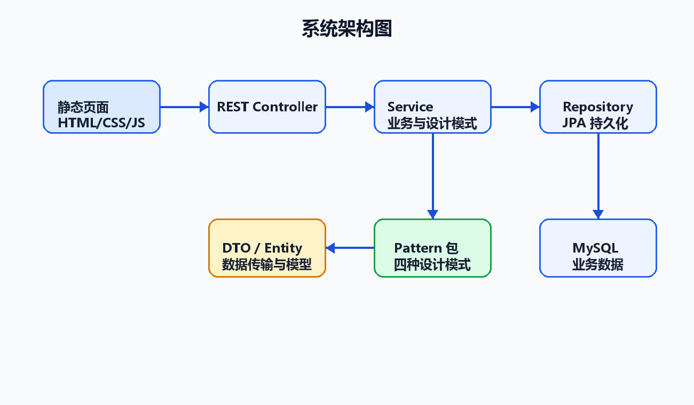

# 实验室设备借还报修系统接口说明

## 1. 通用约定

- 接口基础地址：`http://localhost:8080`
- 数据格式：请求体和响应体均使用 `application/json`
- 演示用户：写操作通过请求头 `X-User-Id` 传递当前用户 ID
- 错误响应：业务异常返回 `400`，响应示例为 `{"message":"设备当前不可借用"}`

接口文档顶部适合放一张系统架构图，用来说明前端页面、REST 接口、业务服务、JPA 仓库和 MySQL 之间的调用关系。



## 2. 用户接口

### 2.1 查询演示用户

- 请求：`GET /api/users`
- 说明：获取学生、实验室管理员、指导教师、学院负责人四类演示用户。
- 响应字段：`id`、`username`、`realName`、`role`、`roleLabel`、`department`

## 3. 设备接口

### 3.1 查询设备

- 请求：`GET /api/equipment?keyword=示波器`
- 说明：按设备名称或编号模糊查询；不传 `keyword` 时返回全部设备。
- 响应字段：`id`、`code`、`name`、`categoryLabel`、`statusLabel`、`labRoom`、`value`、`manager`

### 3.2 新增设备

- 请求：`POST /api/equipment`
- 请求头：`X-User-Id: 2`
- 权限：实验室管理员、指导教师、学院负责人
- 请求体：

```json
{
  "code": "LAB-N-005",
  "name": "函数信号发生器",
  "category": "NORMAL",
  "labRoom": "综合实验室A301",
  "value": 1200,
  "manager": "王老师",
  "description": "电子技术实验设备"
}
```

### 3.3 修改设备

- 请求：`PUT /api/equipment/{id}`
- 请求头：`X-User-Id: 2`
- 权限：实验室管理员、指导教师、学院负责人
- 说明：已报废设备不能修改。

### 3.4 报废设备

- 请求：`POST /api/equipment/{id}/scrap`
- 请求头：`X-User-Id: 2`
- 权限：实验室管理员、指导教师、学院负责人
- 说明：通过状态模式校验当前状态是否允许报废。

设备接口这一节如果需要补图，放“状态模式结构图”最合适，因为新增、报废、借用、报修都会影响设备状态。


## 4. 借用接口

### 4.1 查询借用申请

- 请求：`GET /api/borrows?mine=false`
- 请求头：`X-User-Id: 1`
- 说明：学生只能看到自己的申请；管理角色可查看全部申请。

### 4.2 提交借用申请

- 请求：`POST /api/borrows`
- 请求头：`X-User-Id: 1`
- 说明：职责链模式根据设备类别、价值和借用天数计算所需审批角色。
- 请求体：

```json
{
  "equipmentId": 1,
  "startDate": "2026-05-24",
  "expectedReturnDate": "2026-05-27",
  "purpose": "课程实验使用"
}
```

### 4.3 审批通过

- 请求：`POST /api/borrows/{id}/approve`
- 请求头：`X-User-Id: 2`
- 权限：当前用户角色等级必须大于或等于申请所需审批角色。
- 请求体：`{"comment":"审批同意"}`

### 4.4 驳回申请

- 请求：`POST /api/borrows/{id}/reject`
- 请求头：`X-User-Id: 2`
- 请求体：`{"reason":"设备使用时间冲突"}`

### 4.5 登记归还

- 请求：`POST /api/borrows/{id}/return`
- 请求头：`X-User-Id: 2`
- 说明：策略模式按设备类别计算逾期费用；状态模式将设备恢复为可借用。
- 请求体：`{"actualReturnDate":"2026-05-30"}`

借用接口这一节适合放两张图：提交与审批接口对应职责链模式，归还接口对应策略模式。


## 5. 维修接口

### 5.1 查询维修工单

- 请求：`GET /api/repairs`
- 说明：返回所有维修工单，按创建时间倒序排列。

### 5.2 提交报修

- 请求：`POST /api/repairs`
- 请求头：`X-User-Id: 1`
- 说明：状态模式将设备置为维修中，观察者模式生成通知和日志。
- 请求体：

```json
{
  "equipmentId": 2,
  "faultDescription": "开机后无法进入系统"
}
```

### 5.3 开始维修

- 请求：`POST /api/repairs/{id}/start`
- 请求头：`X-User-Id: 2`
- 权限：实验室管理员、指导教师、学院负责人

### 5.4 完成维修

- 请求：`POST /api/repairs/{id}/complete`
- 请求头：`X-User-Id: 2`
- 请求体：`{"repairResult":"更换硬盘后测试正常"}`

维修接口这一节适合放观察者模式图，因为维修提交、维修开始、维修完成都会产生通知和日志。


## 6. 通知与日志接口

### 6.1 查询当前用户通知

- 请求：`GET /api/notifications`
- 请求头：`X-User-Id: 1`

### 6.2 标记通知已读

- 请求：`POST /api/notifications/{id}/read`
- 请求头：`X-User-Id: 1`

### 6.3 查询系统日志

- 请求：`GET /api/notifications/logs`
- 说明：返回最近 50 条系统日志，用于展示观察者模式产生的记录。
