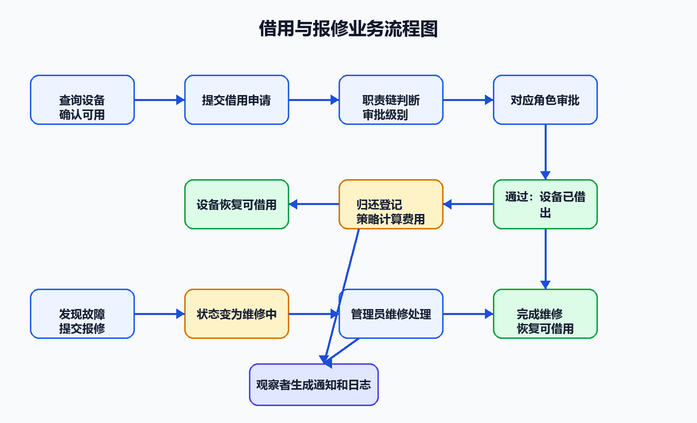
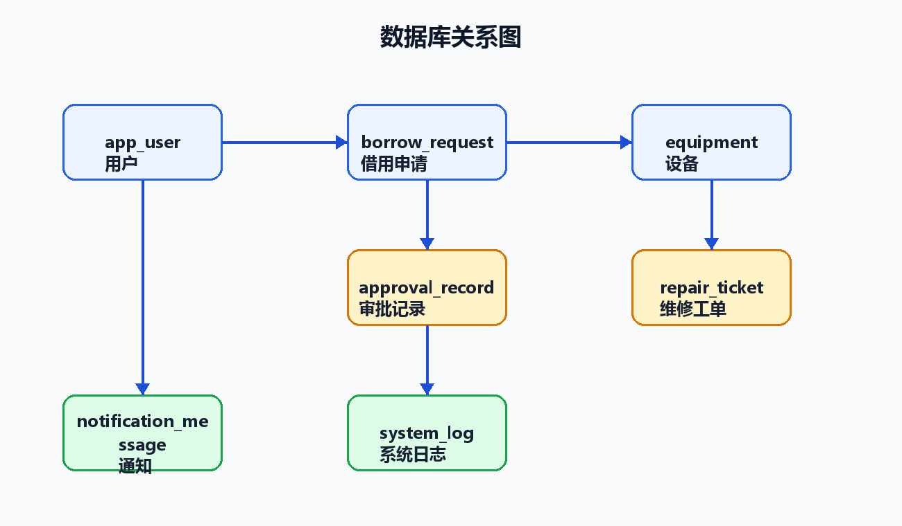
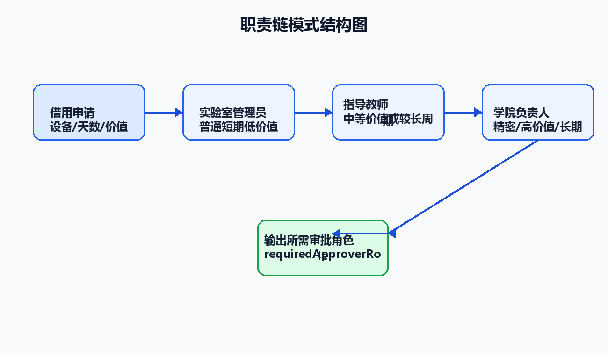
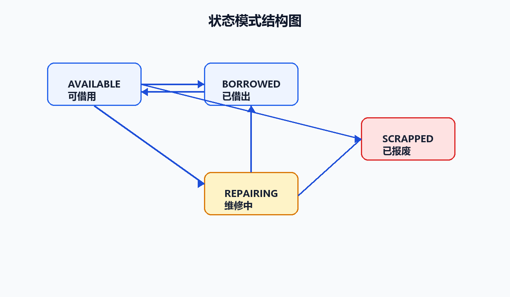
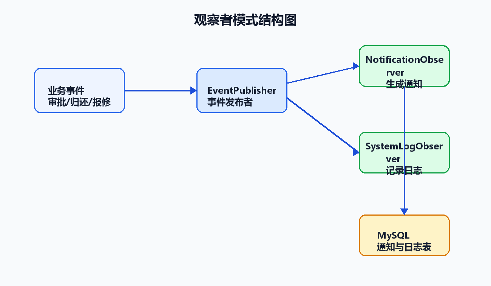
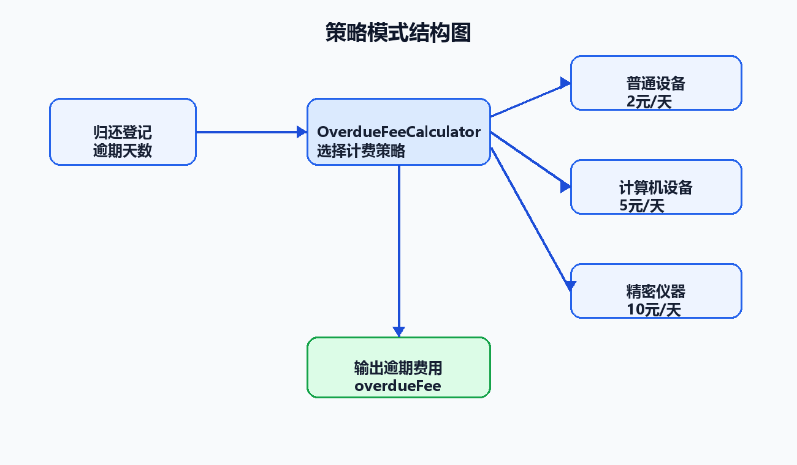

# 实验室设备借还报修系统需求分析文档

## 1. 项目背景

高校实验室设备种类多、价值差异大，设备借用、审批、归还和报修过程如果只依赖线下登记，容易出现设备状态不清、审批责任不明确、维修通知不及时等问题。本系统面向实验室设备日常管理场景，提供设备查询、借用申请、分级审批、归还登记、故障报修、维修处理和消息通知功能。

## 2. 系统目标

- 实现设备信息统一管理，清晰展示设备编号、类别、价值、所在实验室和当前状态。
- 实现设备借用申请与分级审批，按设备价值、类别和借用天数自动确定审批角色。
- 实现设备状态自动流转，避免维修中、已借出、已报废设备被重复借用。
- 实现设备归还登记和逾期费用计算，按设备类别采用不同计费规则。
- 实现设备报修与维修闭环处理，关键业务事件自动生成通知和日志。
- 提供 Web 可视化页面，便于课程设计答辩时演示完整业务流程。

## 3. 用户角色

| 角色 | 主要职责 |
| --- | --- |
| 学生 | 查询设备、提交借用申请、提交报修、查看个人通知 |
| 实验室管理员 | 管理普通设备、审批普通短期借用、登记归还、处理维修 |
| 指导教师 | 审批中等价值或较长周期借用，参与设备管理与维修处理 |
| 学院负责人 | 审批高价值、精密仪器或长期借用，处理高权限设备管理操作 |

## 4. 功能需求

本节需要放置一张整体业务流程图，用来说明借用流程、归还流程、报修流程和通知日志之间的关系。

### 4.1 设备管理

- 系统应支持查询设备列表，并按设备名称或编号进行模糊搜索。
- 系统应展示设备类别、状态、实验室位置、价值、负责人和说明信息。
- 管理角色应能新增、修改和报废设备。
- 已报废设备不允许继续修改或借用。

### 4.2 借用申请

- 学生可选择可借用设备，填写借用开始日期、预计归还日期和用途后提交申请。
- 系统应校验预计归还日期必须晚于开始日期。
- 系统应拒绝对维修中、已借出或已报废设备提交借用申请。
- 系统应保存申请记录，初始状态为“待审批”。

### 4.3 分级审批

- 系统应根据借用天数、设备类别和设备价值确定审批角色。
- 普通设备短期低价值借用由实验室管理员审批。
- 中等价值或较长周期借用由指导教师审批。
- 精密仪器、高价值或长期借用由学院负责人审批。
- 审批通过后设备状态变为“已借出”；驳回后申请状态变为“已驳回”。

### 4.4 归还登记

- 已审批通过的借用申请可以登记归还。
- 系统应记录实际归还日期。
- 系统应根据实际归还日期与预计归还日期计算逾期天数。
- 系统应按普通设备、计算机设备、精密仪器分别计算逾期费用。
- 归还完成后设备状态恢复为“可借用”。

### 4.5 报修维修

- 用户可对设备提交报修，填写故障描述。
- 报修提交后设备状态应变为“维修中”。
- 管理角色可以开始维修和完成维修。
- 维修完成后系统记录维修结果，设备状态恢复为“可借用”。

### 4.6 通知与日志

- 借用提交、审批通过、审批驳回、归还、报修、维修开始、维修完成等事件应生成通知。
- 系统应记录关键事件日志，便于管理员查看业务流转过程。
- 用户应能查看个人通知并标记已读。

## 5. 非功能需求

- 可用性：页面操作简单，支持通过演示用户切换展示不同角色权限。
- 可维护性：核心业务按 Controller、Service、Repository、Entity 分层组织。
- 可扩展性：审批规则、设备状态、费用计算和事件通知分别通过设计模式封装，便于后续扩展。
- 数据持久化：用户、设备、借用申请、审批记录、维修工单、通知和日志均存入 MySQL。
- 安全性：课程设计阶段不实现复杂登录认证，但后端仍通过角色判断限制关键写操作。

本节的数据持久化需求需要配一张数据库关系图，展示用户、设备、借用申请、审批记录、维修工单、通知和日志之间的关联。

## 6. 设计模式需求映射

| 设计模式 | 对应需求 | 作用 |
| --- | --- | --- |
| 职责链模式 | 分级审批 | 将实验室管理员、指导教师、学院负责人串成审批链，自动确定审批级别 |
| 状态模式 | 设备状态流转 | 控制设备在可借用、已借出、维修中、已报废状态下允许的操作 |
| 观察者模式 | 通知与日志 | 业务事件发生后自动通知用户并记录系统日志 |
| 策略模式 | 逾期费用计算 | 根据普通设备、计算机设备、精密仪器选择不同计费策略 |

本节需要放置四张设计模式结构图，分别对应课程设计任务书要求中的“系统模式结构图”。

## 7. 业务流程

### 7.1 借用流程

用户查询设备，选择可借用设备提交申请；系统通过职责链计算审批角色；对应审批角色审批通过后，状态模式将设备置为已借出；归还时系统按策略模式计算逾期费用，并将设备恢复为可借用。

### 7.2 报修流程

用户提交设备报修后，状态模式将设备置为维修中；管理角色开始维修并填写维修结果；维修完成后设备恢复为可借用；整个过程中观察者模式持续生成通知和系统日志。

## 8. 验收标准

- 能启动 Spring Boot 项目并访问 Web 页面。
- 能使用 MySQL 保存并查询业务数据。
- 能演示设备借用、审批、归还、报修、维修和通知流程。
- 能在源码中明确找到职责链、状态、观察者、策略四种设计模式实现。
- 能通过自动化测试验证核心业务流程。
